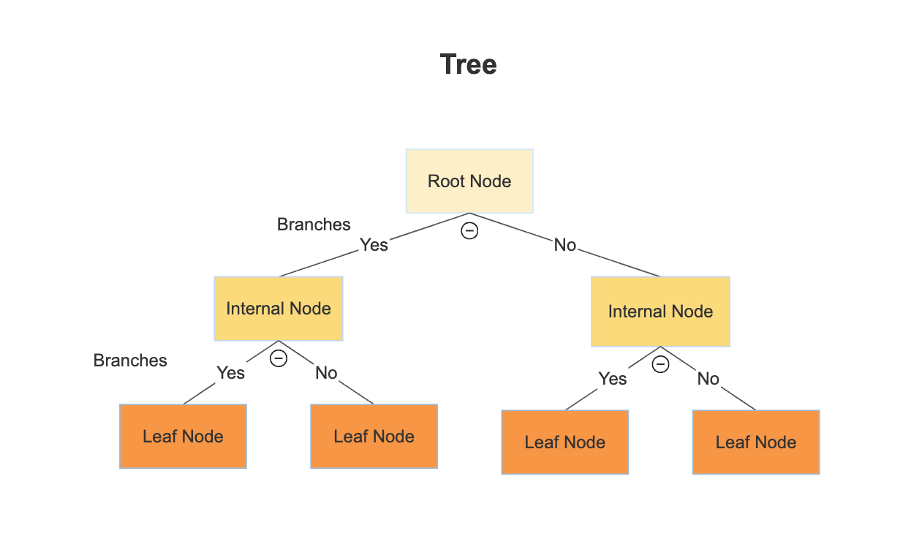

# Overfitting and Underfitting 
### Summary 
Overfitting - occurs when your model captures patterns in the training data that doesn't accurately predict new data. 

Underfitting - the model fails to capture predictive patterns

Both these cases lead to inaccurate models. Our job is to find a balance between these overfitting and underfitting. 

---
### Examples 
Overfitting: Like the example in Section 4 - Validation. Our training data had a pattern where green doors associated with expensive houses. Our model learned that green doors lead to higher priced homes. But this isn't an true predictive characteristic for future datasets. 

Underfitting: If you're using a DecisionTree and you don't use enough nodes. If the max leaf nodes are 4 

